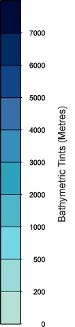

# Administrator Guide for CEEDS Tool
This guide contains a technical description of the CEEDS Tool, how to make changes, add new layers etc.

---
##  Technical Description of the Tool
The CEEDS tool comprises of several components:

    - a react web app
    - a vector tile server called mbtileserver
    - nginx reverse proxy server
    - systemd services
    - node package manager

---
## Description of layer organisation
The CEEDS tool organises layers in multiple ways, each layer switch on CEEDS (both data and map) can actually
represent multiple layers. This is if it is desired that multiple layers should only be able to enabled or
disabled together. An example is the roads layer, this actually comprises of three layers, bridges, roads and
tunnels. 

Therefore the administrator will need to define each layer in mapstyle.json, then define categories in 
data-layers.tsx containing each layer. Categories can have one or more layers. Please see adding new layers
section for more information.

Layers can also be set to be interactive and down-loadable depending on the requirements of the layer. If the layer has an legend, e.g. raster layer then a legend can also be enabled.
The next sections describe the two types of layer and define interactive and down-loadable with respect to a layer.

### Map Layers
These are elements of the base map, they can be enabled and disabled as needed from the map layers tab. 

### Data Layers
These are the switches that enable and disable CEEDS data layers. Other third party layers if added
would also be here.

### Interactive Layers
These are layers that have an interactive component, these could be polygons provided by CEEDS tileserver, 
parts of the base map layer or even third party sources. The interactivity of a given layer can be enabled 
or disabled as desired here. E.g. by default on CEEDS all map layers are set to not be interactive but this 
could be enabled if needed.
> **NOTE: some layers can't be made interactive even if they have interactive components, 
> most notably ones who are defined as background layers.**

### Down-loadable Layers
These are layers that can be downloaded, they need to be interactive (i.e. have data associated) but the 
administrator has to ensure that the format will work correctly with the download function. For this reason
the layer needs to be explicitly enabled to be downloaded.

### Legend Layers

If a layer has an associated legend (this should be an jpg that has the same name as the data layer) this can be saved to the assets folder in the main application folder and a boolean term added to the mapstyle json file.

---

## Adding new layers
If new data sources appear (either third party or new tilesets in CEEDS tile server) they will need to be added
to the CEEDS web app. There are two files that need editing and several places within the files that will need
editing. The specifics will depend on multiple factors examples include:

    - If there is a new source
    - If the layer needs to be highlighted when selected
    - If it is a continuous raster


### Define Source (mapstyle.json)
In the mapstyle.json file, the sources that are used to build the map must be defines here. There will be a
map source from mapbox that is used to build the basemap and also a CEEDS source (the mbtileserver) if there
are any third party sources they will also be defined here. Below is an example:

```json
"sources": {
        "CEEDS": {
            "url": "http://localhost:8000/services/out",
            "type": "vector"
        },
        "mapbox":{
            "url": "mapbox://mapbox.mapbox-streets-v7",
            "type": "vector"
        },
        "gebco2022":{
            "type": "raster",
            "tiles": [
                "https://www.gebco.net/data_and_products/gebco_web_services/web_map_service/mapserv?]
        }
    }
```
This shows the CEEDS, and mapbox sources, they are both defined as vector sources. There is also a third party WMS
layer defined, this is set as a raster. 
> **NOTE: the WMS url request parameters have been removed for formatting purposes see the mapstyle json file for
> full url**

Any new sources will need to be added here. Then the layers within that source can be defined.

### Define layer (mapstyle.json)
After source in this file is where layers are defined. An example from the CEEDS tileserver is shown below:
```json
        {
            "id": "seagrass",
            "type": "fill",
            "source": "CEEDS",
            "source-layer": "reprojectedseagrass",
            "paint": {
                "fill-opacity": ["case",
                ["boolean",["feature-state", "select"], false],1.0,0.75],
                "fill-color": ["case",
                ["boolean",["feature-state", "select"], false],"#ee6b6e","#0080ff"]},
            "interactive": true,
            "downloadable": true,
            "legend": true
        }
```
The administrator can define things like id (this should be unique and noted for use in the data-layers.tsx file) and source (defined above in sources section). In the mbtileserver example, there are multiple layers in the source and source-layer is where it would be defined. The admin can then set the paint parameters, this will define the color and opacity of the layer. If the layer contains features that should be highlighted when clicked then this will need to be defined here. Both fill-opacity and fill-color defined above have two states, when highlighted and when not. The boolean feature-state, select is what sets this (is set to true when clicked) therefore the administrator will put both the true and false states in here. E.g. the seagrass example above sets opacity as 1 when clicked and 0.75 when not. And likewise the colour is #ee6b6e (red) when clicked and #0080ff (blue) when not.

Finally the last three terms set the interactive, down-loadable and legend states of the layers. These are independent but it is expected that a down-loadable layer is also interactive as otherwise users would not be able to see any data when clicking the layer. Also if a layer is not interactive it does not need the boolean feature state parameters setting as it will not be possible to highlight it. If legend is set to true then any jpeg file that is saved to the /assets folder of the main application will be overlaid on the map. The filename needs to match the layer name e.g. GEBCO.jpg. The legend will be placed in the bottom left and set to 400 pixels high with the width scaled to fit. Therefore some care in the layout of the legend is needed. The image below shows an example that is suitable.

<div align="center">

<p> GEBCO Legend example </p>
</div>

It is expected that raster WMS layers that are provided by third party sources will provide a legend that can be added to CEEDS.

To make highlighting more prominent,a outline layer can also be used. This when clicked will create a outline around the feature to display it more prominently. The example below shows what would be used for the seagrass example above

```json
        {
            "id": "seagrass-boundary",
            "type": "line",
            "source": "CEEDS",
            "source-layer": "reprojectedseagrass",
            "paint": {
                "line-opacity": 1,
                "line-color": "#FF0000",
                "line-width": ["case",
                ["boolean",["feature-state", "select"], false],2,0]},
            "interactive": true
        }
```
This is basically an identical layer to the sea-grass but with the type set to line rather than fill (since it is creating) the boundary. In the paint section the colour and opacity of the line is set with a boolean feature state select on the width to determine what width it should be when true or false. In this case it is 2 when true and 0 when false. Therefore when a feature is clicked this layer will draw a boundary around the fill layer it matches and when it is not clicked it will not draw a boundary. To work this layer must also be set to interactive. 
> **NOTE: it is important that the id name must contain the id from the layer it is drawing a line around. In this 
> case it is seagrass. The convention suggested is to use the same name with a boundary suffix. e.g. seagrass-boundary**

Finally it is important to consider the order of layers in the mapstyle.json file. The app will plot each layer on top of the other. Which can be important depending on what is being plotted. For the sea-grass example above this is added to the end of the file as it should overlay everything. But the WMS source layer is added much sooner, in this case after the background and before the roads, labels and sea-grass etc. As it is a continuous layer it will cover everything so it is important to add it before anything you want to see at the same time as it.

### Define or add to category (data-layers.txt)
Now that the layers are defined in the mapstyle.json file they need to be categorised before they will appear in the 
CEEDS app. This is designed so that multiple layers can be part of one "layer" in CEEDS, this allows multiple source 
layers to act as one. Examples of this are plotting roads, bridges and tunnels as roads and seagrass and
seagrass-boundary as seagrass. To do this the administrator must add entries to the data-layers.tsx file.

This is an array of categories. A seagrass example is shown below:
```typescript
    [{
        category: "Seagrass",
        layerSelector: /seagrass/,
        visible: true,
        data: true
    }]
```
There are four parameters to set, the first is the category name, this is what will be displayed as the layer name
on the left panel of CEEDS Tool. Care should be taken with the name, too long and it will impact the site layout.

The next parameter is the layerSelector, this is what is used to link layers in mapstyles.json with the category 
defined here. In the example above any layer with seagrass in its id (e.g. seagrass and seagrass-boundary) 
will be added to this category. Multiple selectors can be used as follows:

```typescript
    layerSelector: /bridge|road|tunnel/
```
In this example all layers with bridge, road and tunnel in their id's will be added to this category. 

This shows it is important to consider the id name carefully and ensure the selector used only relates to the 
desired layers. e.g. calling the "water" layer "sea" would result in it appearing with the seagrass category.

Finally the admin can set if the layer is enabled by default (most will be set to false and invisible to reduce
loading times and reduce layers overlaying each other) and if it is a data layer. If set to true this layer will 
be in the data layer tab in the CEEDS tool (one shown by default) and if false the layer will be put in the map
layer tab (this is primarily for base map layers)


