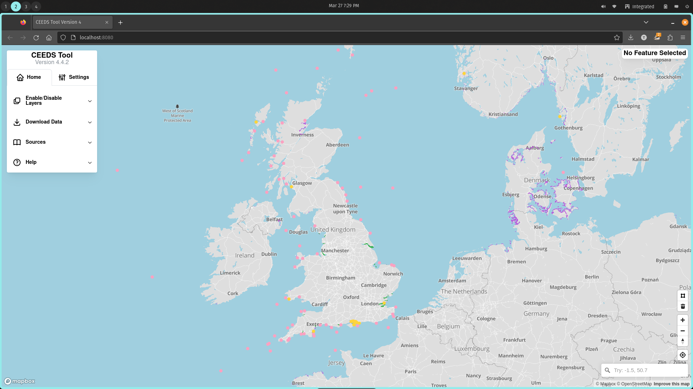
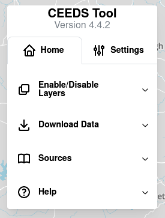
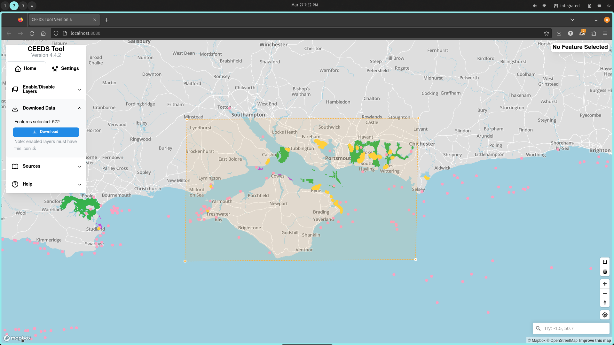

# CEEDS Tool User Guide
This guide details how to use the CEEDS decision support tool. Most of the operation should be intuitive for the average user to understand but there are some functions that are likely to need explanation, (downloading data, connecting to GIS programs etc) and this document should serve as a helpful look up guide.

## CEEDS Capabilities

The CEEDS tool has the following capabilities:
    - Displays ReSOW project output in visual spatial layers
    - Can display other sources of data such as third party WMS
    - Users can enable or disable specific layers
    - Users can click on features within interactive layers to see data associated with feature
    - Able to download subsets of layers by drawing a polygon and downloading features inside
    - Use GIS program (e.g. QGIS) to connect to tile server back-end and get ReSOW data directly

> **NOTE: Third party or download-able layers can only be added by administrators following instructions in admin guide**

## How to use:
CEEDS comprises of a map base layer that takes up the whole browser window. Overlaid on this are two panels, the left containing a stack of collapsed menus and the right which 
is not usually open unless a feature is selected. There are also various controls on the bottom right of the map screen for drawing and deleting polygons, navigating the map 
and searching for locations. The bottom left is reserved for legends if enabled for specific layers. 

### Description of User Interface

#### Map view
This displays a map of the world, by default the tool opens over the UK but the user can pan and zoom to anywhere in the world.

 Default Map View 

#### Left Panel

This is the main control for CEEDS, it contains a two tabs, a home and a settings tab. The home tab contains a series of menus that by default are collapsed. These menus are:

- Enable/Disable data layers
- Download Data
- Sources
- Help

The settings tab contains less used options, currently toggles to turn off parts of the basemap (e.g. labels, roads) if needed.

The user can open and close the menus as needed, by toggling off or on layers as many are not enabled by default (e.g. raster layers) opening the download menu will show
how many features can currently be downloaded (see downloading data section for more details) and a download button that if clicked will download a CSV containing the feature data for each enabled
layer. (Not all layers can be downloaded). Sources provides source links for the data, the application code and the mapping provider. Finally there is a help menu that provides 
a few hints to help the user as well as a link to this documentation.

	

		

			
			
 Default left panel 

		

		

			
			
Left panel will data layer menu extended

		

	

#### Right Panel

Upon opening this panel is minimised, saying no feature selected. Once a user selects a feature in an interactive layer (mouse cursor turns to pointer on hover) then the data held in that feature is populated into the right panel. The panel takes up 60% of the height of the map view and if the data held is longer than this then scroll bars appear allowing the user to scroll and see all the data held. 

    

        

            
			
 Default right panel

        

		

            
			
Right panel with example data

        

	

#### Drawing control

Located on the bottom right side of the map, this contains two buttons. The top one allows you to draw a polygon on the map by left clicking vertices. Double left click will complete the polygon. To delete the polygon the user can select it so it is highlighted then click the second button which will delete it. 

#### Geocoder (search)

At the bottom left there is also a search box, here the user can search for locations where the map will then pan too. It supports place names, post codes and can also find locations based on latitude and longitude. By writing in two number seperated by a comma the option to set them as lat/lon should pop up. The user can then select them to center the map on this location.

#### Navigation control

Located in the bottom left above the geocoder and below the drawing control are navigation controls, these allow the user to pan and zoom the map as they desire. There is also a pan to location control where the map can center on the users location. (they will need to provide permission)

Controls on bottom left of map

### Downloading Data as CSV file

CEEDS provides the option to download a subset of the ReSOW data. This is useful if users wish to have data for a certain area and would like to do some analysis or 
statistics etc. Not all data layers are download-able, if they are then they will have a download icon on their enable/disable switch. Steps to download data:

1. Pan to area of interest
2. Enable all the layers user wishes to download
3. Click draw polygon button in bottom right
4. Left click around area of interest ensuring all features are within
5. Double click to complete polygon
6. Open download sub menu
7. Click Download

The web browser will download a CSV of the data subset for each enabled layer and save it in the default location (usually user downloads directory). This can be easily opened
in Excel or similar.

Example of a polygon

### Connect ReSOW data source to GIS programs

The CEEDS tool may be a bit limiting to technical users who wish to do complicated geo-spatial operations, so the option is also present to allow these users 
who are familiar with GIS programs/work-flows to import the ReSOW data directly into the program. This process for different GIS programs is detailed below:

#### QGIS

1. Open new project
2. Select import new layer => vector tile
3. Fill out dialog box with:
   - URL
   - Name 
   - Click add
   - Ignore style missing error message.....

Example of a data layer in QGIS

#### ArcGIS online

Not working yet, most likely needs domain name with non self signed SSL certificate

#### ArcMap

Not yet tested

